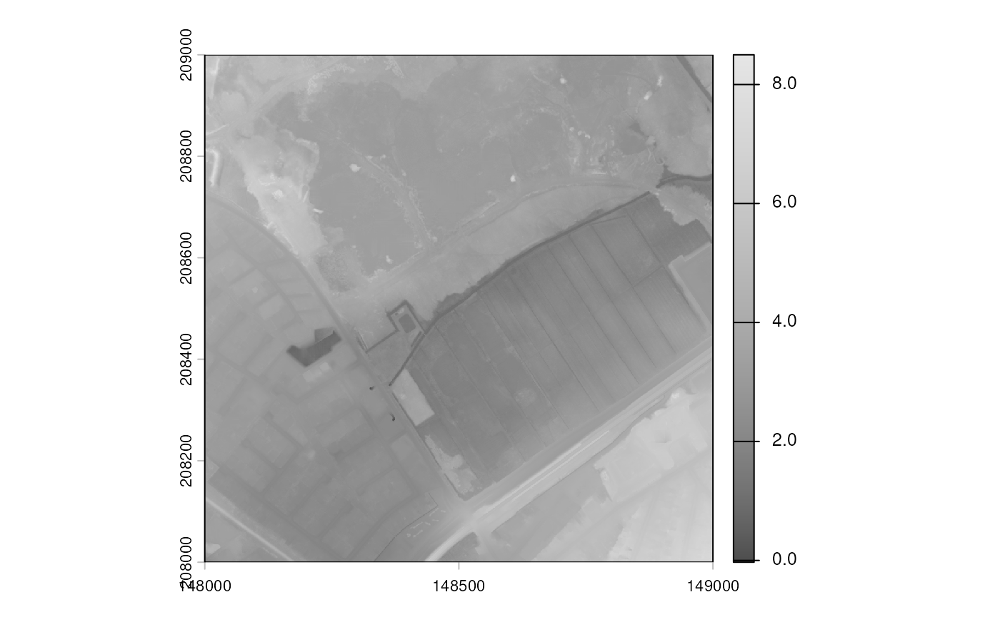

# Dissecting a WCS Query: DHMV Case Study.

## DHMV Data

Flemish government agencies host a lot of useful web services and data.
Some of those are available via web services and can be found here:

- <https://www.vlaanderen.be/datavindplaats/catalogus>

This vignette demonstrates the **query of elevation data from the
Digital Elevation Model**, `Digitaal HoogteModel Vlaanderen` (DHMV). We
will do it “the complicated way”, assembling a Web Coverage Service
(WCS) query. [In the end](#orgd59526e), you will see how to use
`inbospatial` to get the same result in a single function call.

This vignette is somewhat related to, but goes beyond the use of Web
Feature Services (WFS) for spatial data, [see this tutorial by Thierry
Onkelinx](https://tutorials.inbo.be/tutorials/spatial_wfs_services/). In
particular, I will document some paths and workarounds to explore if
errors occur in the default `ows4R` procedure.

**TL;DR:** see the `?inbospatial:get_coverage_wcs` function to query
DHMV (or other WCS) data of a given point in Flanders. An example can be
found below.

## Situation/Motivation

The purpose of the code below is to query elevation data for an
arbitrary location in Flanders. It can be found here:

- <https://www.vlaanderen.be/datavindplaats/catalogus/wcs-digitaal-hoogtemodel-vlaanderen>

Unfortunately, documentation about the WCS is sparse, so let’s hope it
complies with given standards.

We will use Web Coverage Services (WCS), as standardized by the Open
Geospatial Consortium (OGC). More info on these services can be found
[in the “Geocomputation with R” book, for
example](https://r.geocompx.org/read-write#geographic-web-services). The
go-to R package for WCS is `ows4R` by Emmanuel Blondel and contributors,
[available on github](https://eblondel.github.io/ows4R/).

Unfortunately, neither the geocomputation book’s example, nor the
vignette in [the `ows4R`
package](https://eblondel.github.io/ows4R/articles/wcs.html), nor [the
INBO
tutorial](https://tutorials.inbo.be/tutorials/spatial_wfs_services/)
could be transferred to the DHMV use case. The code simply did not work.

Therefore, I ended up going back to the nitty-gritty aspects of WCS by
**manually building a query**.

## Limits of `ows4R` Package

Before revealing [the solution](#org803f24d), I will document the error
and my path to working around it: the core problem was not trivial to
see, and you might run into similar issues.

Because, in fact, the `ows4R` package seems functional. In the tutorial
mentioned above, [the `ows4R`
package](https://CRAN.R-project.org/package=ows4R) is used to query data
from web services. However, `ows4R` cannot handle all niche server
interfaces.

First, we need to load some packages.

``` r

library("httr2")
library("sf")
#> Linking to GEOS 3.12.1, GDAL 3.8.4, PROJ 9.4.0; sf_use_s2() is TRUE
library("terra")
#> terra 1.9.11
library("ows4R")
#> Loading ISO 19139 XML schemas...
#> Loading ISO 19115-3 XML schemas...
#> Loading ISO 19139 codelists...
```

We can connect a WCS client.

``` r

wcs <- ows4R::WCSClient$new(
  "https://geo.api.vlaanderen.be/DHMV/wcs", "2.0.1",
  logger = "INFO"
)
#> [ows4R][INFO] OWSGetCapabilities - Fetching https://geo.api.vlaanderen.be/DHMV/wcs?service=WCS&version=2.0.1&request=GetCapabilities 
#>   |                                                                              |                                                                      |   0%  |                                                                              |======================================================================| 100%
```

We can easily query the capabilities:

``` r

caps <- wcs$getCapabilities()
```

This would grab the same info as you can find in this xml file:
<https://geo.api.vlaanderen.be/DHMV/wcs?service=WCS&request=getcapabilities>

Note that the *capabilities* xml holds a lot of valuable information:

- First and foremost, search it for `CoverageID`; in this case, I was
  interested in `DHMVII_DTM_1m`: grid coverage of the LIDAR elevation
  data for Flanders.
- We can also find that the Coordinate Reference System (CRS)
  `crsSupported` is [BD72 / Belgian Lambert
  72](https://epsg.org/crs_31370/BD72-Belgian-Lambert-72.html). Always
  good to know.
- Finally, the capabilities xml provides a `version`: 2.0.1 at the time
  of writing. Yet keep that in mind for a bit.

The “capabilities” are, per OGC standards, your go-to place for finding
WCS documentation.

In R, we can receive further information conveniently via `ows4R`. This
works via the “coverage summary” …

``` r

feature <- "DHMVII_DTM_1m"
dtm_smry <- caps$findCoverageSummaryById(feature, exact = TRUE)
dtm_smry
#> <WCSCoverageSummary>
#> ....|-- CoverageId: DHMVII_DTM_1m
#> ....|-- CoverageSubtype: GridCoverage
#> ....|-- WGS84BoundingBox <OWSWGS84BoundingBox>
#> ........|-- LowerCorner: 2.52 50.64
#> ........|-- UpperCorner: 5.94 51.51
```

… and the coverage description.

``` r

# Get description from the WCS client
dtm_des <- wcs$describeCoverage(feature)
#> [ows4R][INFO] WCSClient - Fetching coverageSummary description for 'DHMVII_DTM_1m' ... 
#> [ows4R][INFO] WCSDescribeCoverage - Fetching https://geo.api.vlaanderen.be/DHMV/wcs?service=WCS&version=2.0.1&coverageId=DHMVII_DTM_1m&request=DescribeCoverage 
#> Downloading: 840 B     Downloading: 840 B     Downloading: 840 B     Downloading: 840 B     Downloading: 840 B     Downloading: 840 B
dtm_des
#> <WCSCoverageDescription>
#> ....|-- boundedBy  [srsName=http://www.opengis.net/def/crs/EPSG/0/31370,axisLabels=x y,uomLabels=Meter Meter,srsDimension=2] <GMLEnvelope>
#> ........|-- lowerCorner: 17000 148000
#> ........|-- upperCorner: 264000 250000
#> ....|-- domainSet  [gml:id=grid_DHMVII_DTM_1m,dimension=2] <GMLRectifiedGrid>
#> ........|-- limits <GMLGridEnvelope>
#> ............|-- low: 0 0
#> ............|-- high: 246999 101999
#> ........|-- axisLabels 
#> ............|-- value: x y
#> ........|-- origin  [gml:id=grid_origin_DHMVII_DTM_1m,srsName=http://www.opengis.net/def/crs/EPSG/0/31370] <GMLPoint>
#> ............|-- pos: 17000.5 249999.5
#> ........|-- offsetVector  [srsName=EPSG:31370,srsDimension=2] 
#> ............|-- value: 1 0
#> ........|-- offsetVector  [srsName=EPSG:31370,srsDimension=2] 
#> ............|-- value: 0 -1
#> ....|-- rangeType <SWEDataRecord>
#> ........|-- field <SWEQuantity>
#> ............|-- description 
#> ................|-- value: Band_1
#> ............|-- nilValues <SWENilValues>
#> ................|-- nilValue  [reason=http://www.opengis.net/def/nil/OGC/0/inapplicable] 
#> ....................|-- value: -9999
#> ............|-- uom  [code=unknown] 
#> ....|-- CoverageId <ISOElementSequence>
#> ........|-- value: DHMVII_DTM_1m
#> ....|-- ServiceParameters <ISOElementSequence>
#> ........|-- CoverageSubtype <ISOElementSequence>
#> ............|-- value: RectifiedGridCoverage
#> ........|-- nativeFormat <ISOElementSequence>
#> ............|-- value: image/tiff
```

Finally, it is important to know which dimensions are available:
`LON/LAT`, `x/y`, or maybe `time`?

``` r

dtm_dims <- dtm_smry$getDimensions()
#> [ows4R][INFO] WCSCoverageSummary - Fetching Coverage envelope dimensions by CRS interpretation
#> No encoding supplied: defaulting to UTF-8.
dtm_dims
#> [[1]]
#> [[1]]$label
#> [1] "x"
#> 
#> [[1]]$uom
#> [1] "Meter"
#> 
#> [[1]]$type
#> [1] "geographic"
#> 
#> 
#> [[2]]
#> [[2]]$label
#> [1] "y"
#> 
#> [[2]]$uom
#> [1] "Meter"
#> 
#> [[2]]$type
#> [1] "geographic"
```

So far, so good.

Now, following the tutorials to get some real data:

``` r

x_test <- 148600
y_test <- 208900
range_m <- 2 # (+/- m)

hopo_boxed <- ows4R::OWSUtils$toBBOX(
  xmin = x_test - range_m,
  xmax = x_test + range_m,
  ymin = y_test - range_m,
  ymax = y_test + range_m
)
```

I will write the file to disk:

``` r

mht_file <- tempfile(fileext = ".mht")

tryCatch({
  dtm_data <- dtm_smry$getCoverage(
    bbox = hopo_boxed,
    filename = mht_file
  )
}, error = function(err) message(err)
)
#> [ows4R][WARN] WCSCoverageSummary - Coverage without temporal dimension: 'time' argument is ignored 
#> [ows4R][WARN] WCSCoverageSummary - Coverage without vertical dimension: 'elevation' argument is ignored 
#> <GMLEnvelope>
#> ....|-- lowerCorner: 148598 208898
#> ....|-- upperCorner: 148602 208902[ows4R][INFO] WCSGetCoverage - Fetching https://geo.api.vlaanderen.be/DHMV/wcs?service=WCS&version=2.0.1&coverageId=DHMVII_DTM_1m&subset=x(148598,148602)&subset=y(208898,208902)&format=image/tiff&request=GetCoverage 
#> Downloading: 2 kB     Downloading: 2 kB     Downloading: 2 kB     Downloading: 2 kB     Downloading: 2 kB     Downloading: 2 kB
#> Warning in new_CppObject_xp(fields$.module, fields$.pointer, ...): GDAL Error
#> 4: `/tmp/Rtmp9y6HFA/file460761583eb4.mht' not recognized as a supported file
#> format.
#> Error:
#> ! [rast] cannot open this file as a SpatRaster: /tmp/Rtmp9y6HFA/file460761583eb4.mht
```

… or, maybe not. The function fails, somehow.

*Status quo:*

- I receive a file (an “mht” because *I called it* “mht”), supposedly
  some kind of GeoTIFF image (because I *asked* for `image/tiff`), yet
  wrapped into other data chunks.
- I also receive a couple of error messages and warnings:
  - *“Start tag expected, ‘\<’ not found”*
  - *“cannot open this file as SpatRaster:…”*
  - The raw file is *“not recognized as being in a supported file
    format. (GDAL error 4)”*

Maybe most useful, `ows4R` briefly displays the URL it used to attempt
data query:
`https://geo.api.vlaanderen.be/DHMV/wcs?service=WCS&version=2.0.1&coverageId=DHMVII_DTM_1m&subset=x(148599,148601)&subset=y(208899,208901)&format=image/tiff&request=GetCoverage`

Let’s break this URL down:

- the desired `service` is indeed `WCS`,
- `version` is `2.0.1` (I would guess)
- `request`, `coverageID`, and `format` seem to be as expected
- there are `subset` components for the respective dimensions.

Feel free to try yourself to paste the URL to a browser and download the
file.

Still, the downloaded file is unreadable. Subtle symptom: even if one
adjusts the `subset` (i.e. `bbox` argument, above), the received tif
does not change in size; the download is bbox-agnostic, so to speak.

Opening the file with a text editor such as [vim](https://www.vim.org),
we see an XML part, some generic binary stuff, some hints that this
[should be a
GML](https://en.wikipedia.org/wiki/Geography_Markup_Language).

There are [sample geoTIFFs
online](https://github.com/mommermi/geotiff_sample/blob/master/sample.tif),
and they look different, or maybe not. GML is clearly not geoTIFF,
except maybe for the binary part (which I tried to extract, to no
avail).

The file does not download with an extension on the author’s OS and
browser. On a different OS, the browser automatically extended it with
“.mht”. In fact, it is [an MHT
file](https://docs.fileformat.com/web/mht). More on that
[below](#mht_solution).

## The Lead: QGIS

Well, there is advanced software to open GeoTIFF’esque files. Or
geography markup. At least some software might be able to identify what
we actually have here.

First, if R failed, Python might work.

    import rasterio
    import rasterio.plot

    data_name = "/tmp/test_hopo.tif"
    tiff = rasterio.open(data_name)
    rasterio.plot.show(tiff, title = "will this work? no!")

… but it doesn’t recognize the file type as raster data.

How about **[QGIS](https://qgis.org)?** *“Spatial Without Compromise”*,
they advertise. Unfortunately, that program also was unable to open the
file downloaded in R.

However, QGIS can actually connect to WCS directly. This does not help
much if you need the data in R. Yet, why not.

Look and behold: QGIS can actually connect to
\<`https://geo.api.vlaanderen.be/DHMV/wcs`\> and query elevation data
for Flanders; good indication that the WCS is, somehow, functional. I
could zoom and move, export images. I could even export the data. I
stopped exporting the data when it threatened to entirely fill my tiny
system partition (the raster data is more than 100GB) - good
confirmation that we want web services for this.

And, luckily, at some careless map movement, I received an error output
from QGIS. With it, QGIS gave me a working URL to query DHMV:

- `https://geo.api.vlaanderen.be/DHMV/wcs?SERVICE=WCS&VERSION=1.0.0&REQUEST=GetCoverage&FORMAT=GeoTIFF&COVERAGE=DHMVII_DTM_1m&BBOX=162064,165735,170953,168882&CRS=EPSG:31370&RESPONSE_CRS=EPSG:31370&WIDTH=1622&HEIGHT=574`


Let’s dissect this URL.

## The Solution: Query Building

If you start at the question mark of the URL, and split at every
ampersand, you can extract the following components from the (correct)
QGIS URL:

| **correct:** |                             |
|--------------|-----------------------------|
| SERVICE      | WCS                         |
| VERSION      | 1.0.0                       |
| REQUEST      | GetCoverage                 |
| FORMAT       | GeoTIFF                     |
| COVERAGE     | DHMVII_DTM_1m               |
| BBOX         | 162064,165735,170953,168882 |
| CRS          | EPSG:31370                  |
| RESPONSE_CRS | EPSG:31370                  |
| WIDTH        | 1622                        |
| HEIGHT       | 574                         |

Compare this to the (unsuccessful) `ows4R` attempt:

| **non-functional:** |                  |
|---------------------|------------------|
| service             | WCS              |
| version             | 2.0.1            |
| coverageId          | DHMVII_DTM_1m    |
| subset              | x(148599,148601) |
| subset              | y(208899,208901) |
| format              | image/tiff       |
| request             | GetCoverage      |

You can selectively shuffle and adjust components, generalizing the
working query and learning about the WCS interface. Which feels a bit
like [fuzzing](https://en.wikipedia.org/wiki/Fuzzing) the WCS.

Here is what I found:

- `service` (`WCS`) and `request` (`DHMVII_DTM_1m`) were correct; the
  latter could be swapped for different datasets
- `coverage` is the correct keyword for reading `DHMVII_DTM_1m`
- `version` must be `1.0.0`; it currently does not work with 2.0.1
- instead of subsetting, we can use a `bbox`…
- … but a `width` and `height` of the output image are mandatory;
  alternatively there are `resx` and `resy` (not shown)
- we must specify a `CRS` (`EPSG:31370`), optionally also a
  `response_crs`
- the `format` is `GeoTIFF`; slashes are weird in URLs anyway

After some more trial and error, I could construct working URLs in R and
generalize this to a function.

``` r

get_elevation_wcs <- function(x, y, range_m = 1, tiff_file = NULL) {
  # Please note that this function lacks a lot of
  # assertions and documentation.

  # get bbox
  bbox <- paste(
    x - range_m, x + range_m,
    y - range_m, y + range_m,
    sep = ","
  )

  # the URL components
  base_url <- "https://geo.api.vlaanderen.be"
  endpoint <- "/DHMV/wcs" # nolint: absolute_path_linter

  # get wcs data
  if (is.null(tiff_file)) {
    tiff_file <- tempfile(fileext = ".tiff")
  }

  httr2::url_modify(base_url, path = endpoint) |>
    httr2::request() |>
    # the query parameters which worked in QGIS
    httr2::req_url_query(
      service = "WCS",
      version = "1.0.0",
      request = "GetCoverage",
      format = "GeoTIFF",
      coverage = "DHMVII_DTM_1m",
      bbox = bbox,
      width = 2 * range_m,
      height = 2 * range_m,
      crs = "EPSG:31370"
    ) |>
    httr2::req_perform(path = tiff_file)

  # re-read raster file
  data <- rast(tiff_file)

  return(data)
}
```

Example usage:

``` r

x_test <- 148600
y_test <- 208900
range_m <- 10 # (+/- m)
test_raster <- get_elevation_wcs(x_test, y_test, range_m = range_m)

# we can extract a value at a point:
extract(test_raster, cbind(x_test, y_test))[[1]]
#> [1] 9.899891
```

Voilà! We can now get the elevation of a given location in Flanders via
DHMV web services.

Major grain of salt: we could not use the latest version, `v2.0.1`, of
the DHMV WCS. This is not a minor limitation, and should be taken
seriously: old versions become obsolete, break, or stop data updates.

## Using Version `2.0.1`

Apparently, the exact symptoms of the failing query above are somewhat
depending on your browser and operating system. Your browser might
detect that the file is an `mht`, or not.

Here is an example of how to build a query with the current version of
DHMV:

``` r

url <- "https://geo.api.vlaanderen.be/DHMV/wcs"

# the query parameters which worked in QGIS
request <- httr2::request(url) |>
  httr2::req_url_query(
    SERVICE = "WCS",
    VERSION = "2.0.1",
    REQUEST = "GetCoverage",
    FORMAT = "image/tiff",
    COVERAGEID = "DHMVII_DTM_1m",
    SUBSET =
      "x,http://www.opengis.net/def/crs/EPSG/0/EPSG:31370(148000,149000)",
    SUBSET =
      "y,http://www.opengis.net/def/crs/EPSG/0/EPSG:31370(208000,209000)",
    SCALEFACTOR = "1",
    CRS = "EPSG:31370",
    RESPONSE_CRS = "EPSG:31370"
  )

# get wcs data
mht_file <- tempfile(fileext = ".mht")

print(request)
#> <httr2_request>
#> GET https://geo.api.vlaanderen.be/DHMV/wcs?SERVICE=WCS&VERSION=2.0.1&REQUEST=GetCoverage&FORMAT=image%2Ftiff&COVERAGEID=DHMVII_DTM_1m&SUBSET=x%2Chttp%3A%2F%2Fwww.opengis.net%2Fdef%2Fcrs%2FEPSG%2F0%2FEPSG%3A31370%28148000%2C149000%29&SUBSET=y%2Chttp%3A%2F%2Fwww.opengis.net%2Fdef%2Fcrs%2FEPSG%2F0%2FEPSG%3A31370%28208000%2C209000%29&SCALEFACTOR=1&CRS=EPSG%3A31370&RESPONSE_CRS=EPSG%3A31370
#> Body: empty
print(mht_file)
#> [1] "/tmp/Rtmp9y6HFA/file460719a7f08a.mht"

response <- httr2::req_perform(
  req = request,
  path = mht_file
)
```

With the `mht` specifications [found
online](https://docs.fileformat.com/web/mht), it is possible to create
an unpacking function, which has become part of this very package.

``` r

unpack_mht <- function(path) {
  raw_vector <- readr::read_file_raw(path)

  # 1. MATCH start of (geoTiff) big or little endian ^(II|MM)\*
  # Look for \nII* (0x0a + 49 49 2a) or \nMM* (0x0a + 4d 4d 2a)
  match_ii <- grepRaw(as.raw(c(0x0a, 0x49, 0x49, 0x2a)), raw_vector)[1]
  match_mm <- grepRaw(as.raw(c(0x0a, 0x4d, 0x4d, 0x2a)), raw_vector)[1]
  valid_matches <- c(match_ii, match_mm)
  valid_matches <- valid_matches[!is.na(valid_matches)]

  if (length(valid_matches) > 0) {
    # +1 to step over the newline character and start exactly at 'I' or 'M'
    pos_start <- min(valid_matches) + 1
  } else {
    # Edge case: If it's on the very first line of the file (no preceding \n)
    if (
      all(raw_vector[1:3] == as.raw(c(0x49, 0x49, 0x2a))) ||
        all(raw_vector[1:3] == as.raw(c(0x4d, 0x4d, 0x2a)))
    ) {
      pos_start <- 1
    } else {
      stop("Could not find TIFF header (II* or MM*) at the start of any line.")
    }
  }

  # 2. Drop the last line
  # MHT files end with a boundary string that usually starts with two hyphens
  # We search for \n-- to safely find the closing boundary and cut the file.
  boundary_matches <- grepRaw(
    as.raw(c(0x0a, 0x2d, 0x2d)), raw_vector, all = TRUE
  )

  if (length(boundary_matches) > 0) {
    pos_end <- tail(boundary_matches, 1) - 1
    # Check for Windows \r\n and step back one more byte if needed
    if (raw_vector[pos_end] == as.raw(0x0d)) pos_end <- pos_end - 1
  } else {
    # Fallback if no boundary exists: chop at the last newline
    newlines <- grepRaw(as.raw(0x0a), raw_vector, all = TRUE)
    pos_end <- tail(newlines, 1) - 1
    if (raw_vector[pos_end] == as.raw(0x0d)) pos_end <- pos_end - 1
  }

  # 3. Extract and Write
  tif <- raw_vector[pos_start:pos_end]
  tif_path <- stringr::str_replace(path, "\\.mht$", ".tif")
  readr::write_file(tif, tif_path)
  return(tif_path)
}
```

This way you get the elevation data extracted:

``` r

tif_file <- unpack_mht(mht_file)
raster <- terra::rast(tif_file)
plot(raster, col = gray.colors(256))
```



## The “`inbospatial`” Way

Colleague [Hans Van Calster](https://github.com/hansvancalster) had been
facing the same problems with related WCS layers a year earlier, and he
wrote a function for it in [the \`inbospatial\`
package](https://github.com/inbo/inbospatial). We now refined the
[`get_coverage_wcs()`](https://inbo.github.io/inbospatial/reference/get_coverage_wcs.md)
procedure to solve the `mht` issue.

Here is how to use it, for the same case as above:

``` r

bbox <- sf::st_bbox(
  c(xmin = 148000, xmax = 149000, ymin = 208000, ymax = 209000),
  crs = sf::st_crs(31370)
)
hopo_raster <- inbospatial::get_coverage_wcs(
  wcs = "dhmv",
  bbox = bbox,
  layername = "DHMVII_DTM_1m",
  version = "2.0.1",
  wcs_crs = "EPSG:31370",
  resolution = 1
)

plot(hopo_raster, col = gray.colors(256))
```


The function gives you quite some options of WCS layers to query data
from.

| **WCS** | **layer name** | **reference** |
|----|----|----|
| dtm | `EL.GridCoverage.DTM` | [here](https://www.vlaanderen.be/datavindplaats/catalogus/hoogte-dtm) |
| dsm | `EL.GridCoverage.DSM` | [here](https://www.vlaanderen.be/datavindplaats/catalogus/hoogte-dsm) |
| dhmv | `DHMVI_DTM_5m` | [here](https://metadata.vlaanderen.be/srv/dut/catalog.search#/metadata/9b0f82c7-57c4-463a-8918-432e41a66355) |
| dhmv | `DHMVII_DTM_1m` | [here](https://metadata.vlaanderen.be/srv/dut/catalog.search#/metadata/f52b1a13-86bc-4b64-8256-88cc0d1a8735) |
| dhmv | `DHMVII_DSM_1m` | [here](https://metadata.vlaanderen.be/srv/dut/catalog.search#/metadata/0da2e5e4-6886-426b-bb82-c0ffe6faeff6) |

At a quick glance, we found that the `dtm` WCS seems to include canopy
points, which is not according to definition; see here:
<https://www.neonscience.org/resources/learning-hub/tutorials/chm-dsm-dtm>
A general advice is to confirm your data for a region you know.

In addition, there are `oi-omz` and `oi-omw` for “zummer” and winter
ortho-mosaic images.

The burden of choice!

## *Post Mortem*

The value of this vignette seems to be limited: in essence, it provides
the specific query function arguments for elevation model queries with
the `geo.api` WCS of the Flemish digital services. Quite a niche use
case.

However, this is also a story of tracing errors in existing tools, and
scraping other tools for hints.

Can we actually trace the error back to a source? It was pure
co-incidence that QGIS provided a working link, or are there general
strategies? As colleague [@florisvdh pointed
out,](https://github.com/inbo/inbospatial/pull/14#discussion_r1853858729)
[QGIS](https://github.com/qgis/QGIS) generally has good heuristics to
infer a web service URL, and choose parameter values which work. Once a
web service layer is successfully loaded in QGIS, one can inspect URLs
and metadata in the layer properties. The QGIS dialogue to add a web
service layer is also helpful in exploring available layers of a web
service.

In retrospective, the initial issue was worsened by unfavourable
circumstances.

- `ows4R` retrieved a file and produced an error; another error was only
  thrown downstream. Neither `ows4R`, nor `terra`, `sf`, `rasterio`, or
  `qgis` were able to handle `mht` files. This lack of support questions
  the WCS design choice of packing and sending an `mht`.
- Documentation for the `geo.api.vlaanderen.be` WCS is lacking (or I did
  not find it); in particularly I missed usage examples, vignettes, or
  tests.

The colleagues at `Digitaal Vlaanderen` or the DHMV group certainly had
enough work on their table, yet more documentation would be desirable.
Same for `ows4R`, judging by their [github issue
list](https://github.com/eblondel/ows4R/issues) (see e.g. [this
one](https://github.com/eblondel/ows4R/issues/114)). On the other hand,
[QGIS is free- and open source](https://en.wikipedia.org/wiki/QGIS), its
queries seem to be well maintained and are accessible, errors are
transparent, I could have read the source code - a good example piece of
software.

Yet in general, if you run into issues like this, do not hesitate to
contact support or [file a github
issue](https://github.com/eblondel/ows4R/issues/114). You should not
need to fuzz a WCS.

Thank you for reading, and may all your spatial queries be successful!

## Table of Contents

- [DHMV Data](#org86b1211)
- [Situation/Motivation](#org75073fb)
- [Limits of `ows4R` Package](#orge6d66b9)
- [The Lead: QGIS](#orgfaa5a3d)
- [The Solution: Query Building](#org803f24d)
- [Using Version `2.0.1`](#mht_solution)
- [The “inbospatial” Way](#orgd59526e)
- [Post Mortem](#org575ca41)
