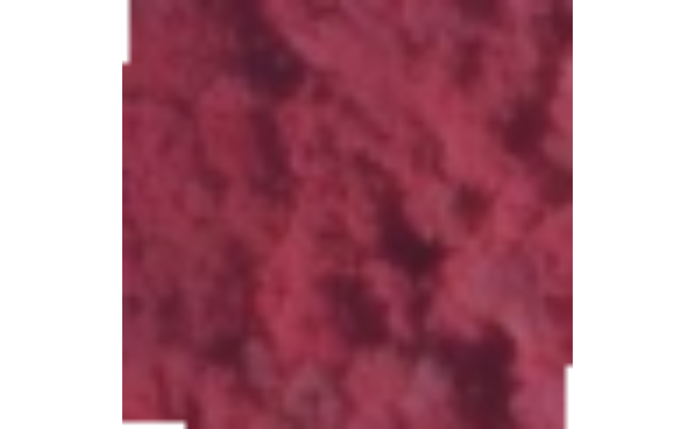
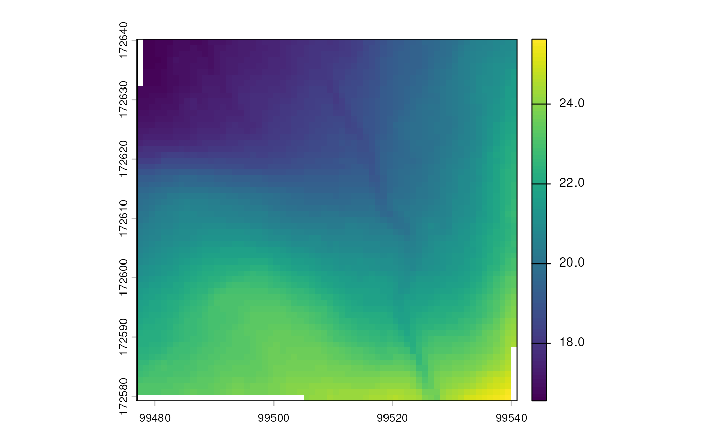
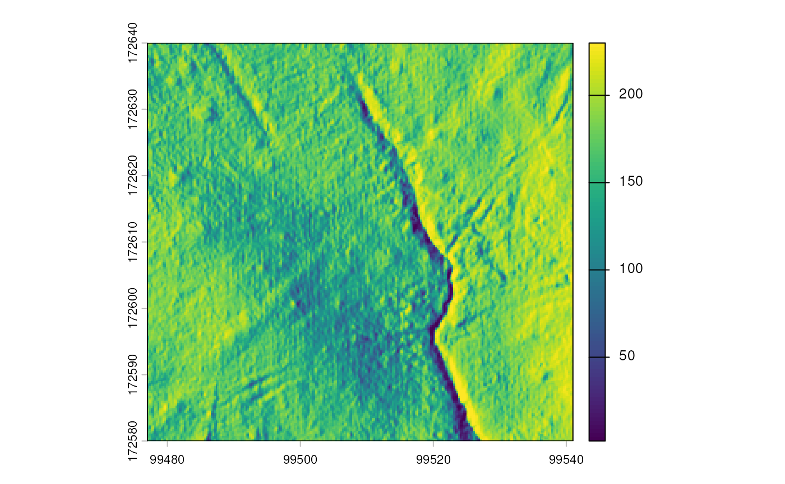
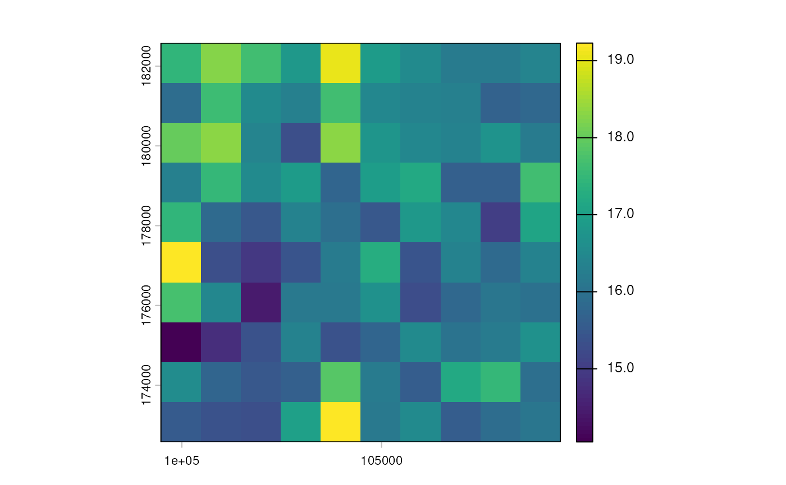

# Example use cases to get vector or raster data from web services.

``` r

library(sf)
#> Linking to GEOS 3.12.1, GDAL 3.8.4, PROJ 9.4.0; sf_use_s2() is TRUE
library(dplyr)
#> 
#> Attaching package: 'dplyr'
#> The following objects are masked from 'package:stats':
#> 
#>     filter, lag
#> The following objects are masked from 'package:base':
#> 
#>     intersect, setdiff, setequal, union
library(inbospatial)
```

## Introduction

Spatial web services allow you to seamlessly pull remote spatial data
directly into your R session without manually downloading, unzipping,
and managing local files.

Historically, the OGC (Open Geospatial Consortium) established standards
like WFS (Web Feature Service) for downloading vector data and WCS (Web
Coverage Service) for downloading raster data. Recently, these older
protocols are being actively replaced by the modern, RESTful OGC API
framework. For instance, OGC API Features is the direct, optimized
successor to WFS.

In this vignette, we will show how the functions
[`get_feature_wfs()`](https://inbo.github.io/inbospatial/reference/get_feature_wfs.md),
[`get_coverage_wcs()`](https://inbo.github.io/inbospatial/reference/get_coverage_wcs.md),
and the newly added
[`get_feature_ogc()`](https://inbo.github.io/inbospatial/reference/get_feature_ogc.md)
can be used to easily fetch data from these services.

For a more in-depth explanation about the underlying mechanics of these
services, we refer to the INBO tutorial about
[WFS](https://tutorials.inbo.be/tutorials/spatial_wfs_services/) and the
vignette about
[WCS](https://inbo.github.io/inbospatial/articles/spatial_dhmv_query.md).
The tutorial and vignette take a more hands-on coding approach to
manually crafting HTTP requests, whereas in this vignette, much of that
complex logic is hidden away safely inside the `inbospatial` functions.

## Overview of Spatial Web Services

Depending on whether you need to actually download the raw data for
spatial analysis, or merely view it as a background map, different web
services are used. The table below outlines the most common services,
their data types, and how they map to the `inbospatial` package.

| Service Standard | Successor / Modern API | GIS Data Type | Primary Purpose | `inbospatial` Function |
|:---|:---|:---|:---|:---|
| **WFS** (Web Feature Service) | OGC API Features | Vector (Points, Lines, Polygons) | **Data Retrieval** | [`get_feature_wfs()`](https://inbo.github.io/inbospatial/reference/get_feature_wfs.md) |
| **WCS** (Web Coverage Service) | OGC API Coverages | Raster (Gridded/Cell data) | **Data Retrieval** | [`get_coverage_wcs()`](https://inbo.github.io/inbospatial/reference/get_coverage_wcs.md) |
| **OGC API Features** | *Current Standard* | Vector (Points, Lines, Polygons) | **Data Retrieval** | [`get_feature_ogc()`](https://inbo.github.io/inbospatial/reference/get_feature_ogc.md) |
| **WMS** (Web Map Service) | OGC API Maps | Raster (Rendered Image) | **Visualization** | `add_wms_*()` |
| **WMTS** (Web Map Tile Service) | OGC API Tiles | Vector or Raster Tiles | **Visualization** | `add_wmts_*()` |

## Vector data examples

This section demonstrates both
[`get_feature_ogc()`](https://inbo.github.io/inbospatial/reference/get_feature_ogc.md)
and `get_feature_wfs`. When you have the choice,
[`get_feature_ogc()`](https://inbo.github.io/inbospatial/reference/get_feature_ogc.md)
is preferred due to better performance and automatic pagination. Because
spatial servers often limit how much data you can download in a single
go, automatic pagination allows the function to detect when more data is
available and quietly make follow-up requests until the entire dataset
is successfully retrieved for you.

### Simple use case without filter

As a test case, we will query provincial boundaries of Flanders from a
layer of the “Provisional Reference of Municipal Boundaries” (`VRBG`,
`Voorlopig ReferentieBestand Gemeentegrenzen`), which is available via
an API on the `vlaanderen.be` website.

``` r

ogc_vrbg <- "https://geo.api.vlaanderen.be/VRBG2025/ogc/features/v1/"

system.time({
  provinces <- get_feature_ogc(
    url = ogc_vrbg,
    collection = "Refprv",
    crs = "EPSG:31370"
  )
})
#>    user  system elapsed 
#>   0.181   0.009   3.986

provinces
#> Simple feature collection with 5 features and 6 fields
#> Geometry type: MULTIPOLYGON
#> Dimension:     XY
#> Bounding box:  xmin: 21991.63 ymin: 153058.3 xmax: 258871.8 ymax: 244027.2
#> Projected CRS: BD72 / Belgian Lambert 72
#> # A tibble: 5 × 7
#>    UIDN  OIDN TERRID NAAM            NISCODE NUTS2                         SHAPE
#> * <dbl> <dbl>  <dbl> <chr>           <chr>   <chr>            <MULTIPOLYGON [m]>
#> 1    23     2    357 Antwerpen       10000   BE21  (((189854.3 238555.1, 189821…
#> 2    24     4    359 Vlaams-Brabant  20001   BE24  (((123085.8 153058.3, 123091…
#> 3    25     3    351 West-Vlaanderen 30000   BE25  (((78795.16 155928.6, 78813.…
#> 4    26     1    355 Limburg         70000   BE22  (((256971.2 156570.3, 256984…
#> 5    27     5    356 Oost-Vlaanderen 40000   BE23  (((97888.3 156976.7, 97895.7…
```

You can achieve (almost) the same result using a combination of
[`sf::read_sf()`](https://r-spatial.github.io/sf/reference/st_read.html)
and
[`sf::st_transform()`](https://r-spatial.github.io/sf/reference/st_transform.html).
For `WFS`, you need to prefix the url with `"WFS:"`. For
`OGC API features`, you need to prefix the url with “`OAPIF`”. We only
show the latter.

``` r

system.time({
  provinces2 <- read_sf(
    paste0("OAPIF:", ogc_vrbg),
    layer = "Refprv"
  )
})
#>    user  system elapsed 
#>   0.771   0.046   4.961

waldo::compare(provinces, provinces2,
  x_arg = "inbospatial", y_arg = "sf",
  max_diffs = 8
)
#> `inbospatial` is length 7
#> `sf` is length 8
#> 
#>     names(inbospatial) | names(sf)     
#> [1] "UIDN"             - "id"       [1]
#> [2] "OIDN"             - "UIDN"     [2]
#> [3] "TERRID"           - "OIDN"     [3]
#> [4] "NAAM"             - "TERRID"   [4]
#> [5] "NISCODE"          - "NAAM"     [5]
#> [6] "NUTS2"            - "NISCODE"  [6]
#> [7] "SHAPE"            - "NUTS2"    [7]
#>                        - "geometry" [8]
#> 
#> `names(attr(inbospatial, 'agr'))[1:3]`:      "UIDN" "OIDN" "TERRID"
#> `names(attr(sf, 'agr'))[1:4]`:          "id" "UIDN" "OIDN" "TERRID"
#> 
#> `attr(inbospatial, 'agr')[4:6]`: "NA" "NA" "NA"     
#> `attr(sf, 'agr')[4:7]`:          "NA" "NA" "NA" "NA"
#> 
#> `attr(inbospatial, 'sf_column')`: "SHAPE"   
#> `attr(sf, 'sf_column')`:          "geometry"
#> 
#> `inbospatial$SHAPE` is an S3 object of class <sfc_MULTIPOLYGON/sfc>, a list
#> `sf$SHAPE` is absent
#> 
#> `inbospatial$id` is absent
#> `sf$id` is a character vector ('Refprv.1', 'Refprv.2', 'Refprv.3', 'Refprv.4', 'Refprv.5')
#> 
#> `inbospatial$geometry` is absent
#> `sf$geometry` is an S3 object of class <sfc_MULTIPOLYGON/sfc>, a list
```

We notice some differences, but nothing substantial. Going via
[`sf::read_sf`](https://r-spatial.github.io/sf/reference/st_read.html)
has added an extra field `id` and renamed `SHAPE` to `geometry`.

Timings do differ substantially. The
[`get_feature_ogc()`](https://inbo.github.io/inbospatial/reference/get_feature_ogc.md)
function should be faster than
[`sf::read_sf`](https://r-spatial.github.io/sf/reference/st_read.html),
because the `OAPIF` method (which is passed on to `GDAL`) relies on the
`geoJSON` file format whereas
[`get_feature_ogc()`](https://inbo.github.io/inbospatial/reference/get_feature_ogc.md)
collects the data as a `geopackage`. The latter is a binary file format
whereas the former is a text format. A binary format is much smaller and
therefore can be downloaded faster. It’s possible that not all providers
of `OGC API features` have implemented `geopackage` as an export option.
If that is the case, you can try
[`read_sf()`](https://r-spatial.github.io/sf/reference/st_read.html)
with `OAPIF` instead.

For reference, here is the code you would use for an equivalent `WFS`
query:

``` r

wfs_vrbg <- "https://geo.api.vlaanderen.be/VRBG/wfs"

provinces <- get_feature_wfs(
  wfs = wfs_vrbg,
  layername = "VRBG:Refprv",
  crs = "EPSG:31370"
)

provinces
```

For `WFS`, you may notice other differences as well, most notably for
field specifications. The reason for such differences is that
[`get_feature_wfs()`](https://inbo.github.io/inbospatial/reference/get_feature_wfs.md)
retrieves whatever information that is identified from the WFS request -
in the same way as you would paste the request in the browser. This
result is then saved temporarily to a `.GML` file and read with
[`sf::read_sf()`](https://r-spatial.github.io/sf/reference/st_read.html).
Passing the WFS directly to the `dsn` argument of
[`sf::read_sf`](https://r-spatial.github.io/sf/reference/st_read.html),
on the other hand, will translate the request to a form that will pass
through [the GDAL WFS
driver](https://gdal.org/en/latest/drivers/vector/wfs.html), which
handles field specifications by reading them from a
`DescribeFeatureType` request:

> At the first opening, the content of the result of the
> `GetCapabilities` request will be appended to the file, so that it can
> be cached for later openings of the dataset. The same applies for the
> `DescribeFeatureType` request issued to discover the field definition
> of each layer.

### Apply a CQL-Filter to filter on a field

CQL, the “Common Query Language” ([see here, for
example](https://docs.geoserver.org/stable/en/user/tutorials/cql/cql_tutorial.html)),
provides a way to filter WFS data. The syntax of [CQL is comparable to
SQL](https://www.webcomand.com/docs/language/cql/cql_vs_sql/), yet there
are differences in data types and structures.

You can provide and apply filters in
[`get_feature_ogc()`](https://inbo.github.io/inbospatial/reference/get_feature_ogc.md)
or
[`get_feature_wfs()`](https://inbo.github.io/inbospatial/reference/get_feature_wfs.md)
via the `cql_filter` argument.

``` r

ogc_vrbg <- "https://geo.api.vlaanderen.be/VRBG2025/ogc/features/v1/"

west_vlaanderen <- get_feature_ogc(
  url = ogc_vrbg,
  collection = "Refprv",
  cql_filter = "NAAM='West-Vlaanderen'",
  crs = "EPSG:31370"
)

west_vlaanderen
#> Simple feature collection with 1 feature and 6 fields
#> Geometry type: MULTIPOLYGON
#> Dimension:     XY
#> Bounding box:  xmin: 21991.63 ymin: 155928.6 xmax: 90410.78 ymax: 229724.6
#> Projected CRS: BD72 / Belgian Lambert 72
#> # A tibble: 1 × 7
#>    UIDN  OIDN TERRID NAAM            NISCODE NUTS2                         SHAPE
#> * <dbl> <dbl>  <dbl> <chr>           <chr>   <chr>            <MULTIPOLYGON [m]>
#> 1    25     3    351 West-Vlaanderen 30000   BE25  (((78795.16 155928.6, 78813.…
```

Here, we could have also used
[`sf::read_sf()`](https://r-spatial.github.io/sf/reference/st_read.html)
in combination with an [OGR SQL
query](https://gdal.org/en/latest/user/ogr_sql_dialect.html):

``` r

west_vlaanderen2 <- read_sf(paste0("OAPIF:", ogc_vrbg),
  query = "SELECT * FROM Refprv WHERE NAAM='West-Vlaanderen'"
)

waldo::compare(west_vlaanderen, west_vlaanderen2)
#> `old` is length 7
#> `new` is length 8
#> 
#>     names(old) | names(new)          
#> [1] "UIDN"     - "id"             [1]
#> [2] "OIDN"     - "UIDN"           [2]
#> [3] "TERRID"   - "OIDN"           [3]
#> [4] "NAAM"     - "TERRID"         [4]
#> [5] "NISCODE"  - "NAAM"           [5]
#> [6] "NUTS2"    - "NISCODE"        [6]
#> [7] "SHAPE"    - "NUTS2"          [7]
#>                - "_ogr_geometry_" [8]
#> 
#> `names(attr(old, 'agr'))[1:3]`:      "UIDN" "OIDN" "TERRID"
#> `names(attr(new, 'agr'))[1:4]`: "id" "UIDN" "OIDN" "TERRID"
#> 
#> `attr(old, 'agr')[4:6]`: "NA" "NA" "NA"     
#> `attr(new, 'agr')[4:7]`: "NA" "NA" "NA" "NA"
#> 
#> `attr(old, 'sf_column')`: "SHAPE"         
#> `attr(new, 'sf_column')`: "_ogr_geometry_"
#> 
#> `old$SHAPE` is an S3 object of class <sfc_MULTIPOLYGON/sfc>, a list
#> `new$SHAPE` is absent
#> 
#> `old$id` is absent
#> `new$id` is a character vector ('Refprv.3')
#> 
#> `old$_ogr_geometry_` is absent
#> `new$_ogr_geometry_` is an S3 object of class <sfc_MULTIPOLYGON/sfc>, a list
```

As before, we notice some differences in naming of the fields and the
addition of an extra field `id` when using
[`read_sf()`](https://r-spatial.github.io/sf/reference/st_read.html).

For reference, here is the code you would use for an equivalent `WFS`
query:

``` r

wfs_vrbg <- "https://geo.api.vlaanderen.be/VRBG/wfs"

west_vlaanderen_wfs <- get_feature_wfs(
  wfs = wfs_vrbg,
  layername = "VRBG:Refprv",
  cql_filter = "NAAM='West-Vlaanderen'"
)

west_vlaanderen_wfs
```

### Request a subset of fields

Instead of querying the complete data table, one can select a subset of
variables (fields). The function
[`get_feature_ogc()`](https://inbo.github.io/inbospatial/reference/get_feature_ogc.md)
provides the `properties` argument for it, which accepts a character
vector of field names (the field containing the geometry is always
returned). The function
[`get_feature_wfs()`](https://inbo.github.io/inbospatial/reference/get_feature_wfs.md)
provides the `property_name` keyword for it, which accepts a string of
comma-separated field names. Note that field names are capitalized on
this particular geoserver.

``` r

ogc_vrbg <- "https://geo.api.vlaanderen.be/VRBG2025/ogc/features/v1/"

prov_fields <- get_feature_ogc(
  url = ogc_vrbg,
  collection = "Refprv",
  crs = "EPSG:31370",
  properties = c("NAAM", "NUTS2")
)

prov_fields
#> Simple feature collection with 5 features and 2 fields
#> Geometry type: MULTIPOLYGON
#> Dimension:     XY
#> Bounding box:  xmin: 21991.63 ymin: 153058.3 xmax: 258871.8 ymax: 244027.2
#> Projected CRS: BD72 / Belgian Lambert 72
#> # A tibble: 5 × 3
#>   NAAM            NUTS2                                                    SHAPE
#> * <chr>           <chr>                                       <MULTIPOLYGON [m]>
#> 1 Antwerpen       BE21  (((189854.3 238555.1, 189821.8 238591.5, 189759.3 23859…
#> 2 Vlaams-Brabant  BE24  (((123085.8 153058.3, 123091.3 153060.2, 123097.3 15307…
#> 3 West-Vlaanderen BE25  (((78795.16 155928.6, 78813.62 156010.4, 78821.33 15607…
#> 4 Limburg         BE22  (((256971.2 156570.3, 256984 156602.7, 256999.7 156641.…
#> 5 Oost-Vlaanderen BE23  (((97888.3 156976.7, 97895.73 156980.9, 97898.28 156984…
```

Again, we can use
[`sf::read_sf()`](https://r-spatial.github.io/sf/reference/st_read.html)
in combination with an [OGR SQL
query](https://gdal.org/en/latest/user/ogr_sql_dialect.html):

``` r

prov_fields_sf <- read_sf(paste0("OAPIF:", ogc_vrbg),
  query = "SELECT NAAM, NUTS2 FROM Refprv"
)

waldo::compare(prov_fields, prov_fields_sf)
#> `names(old)`: "NAAM" "NUTS2" "SHAPE"   
#> `names(new)`: "NAAM" "NUTS2" "geometry"
#> 
#> `attr(old, 'sf_column')`: "SHAPE"   
#> `attr(new, 'sf_column')`: "geometry"
#> 
#> `old$SHAPE` is an S3 object of class <sfc_MULTIPOLYGON/sfc>, a list
#> `new$SHAPE` is absent
#> 
#> `old$geometry` is absent
#> `new$geometry` is an S3 object of class <sfc_MULTIPOLYGON/sfc>, a list
```

For reference, here is the code you would use for an equivalent `WFS`
query:

``` r

wfs_vrbg <- "https://geo.api.vlaanderen.be/VRBG/wfs"

prov_fields_wfs <- get_feature_wfs(
  wfs = wfs_vrbg,
  layername = "VRBG:Refprv",
  crs = "EPSG:31370",
  property_name = paste("NAAM", "NUTS2", "SHAPE", sep = ",")
)

prov_fields_wfs
```

### Meteorological data example

Another example of a WFS API is the Belgian Royal Meteorological
Institute (KMI, `Koninklijk Meteorologisch Instituut van België`).
Details can be [found
here](https://opendata.meteo.be/service/wfs?request=GetCapabilities),
[and
here](https://publish.geo.be/geonetwork/f0ow2say/api/records/RMI_AWS_WFS).

To our knowledge, an `OGC APi features` service is not available for
this vector data source.

``` r

kmi <- "https://opendata.meteo.be/service/wfs"

kmi_stations <- get_feature_wfs(
  wfs = kmi,
  layer = "synop:synop_station"
)

kmi_stations
#> Simple feature collection with 30 features and 6 fields
#> Geometry type: POINT
#> Dimension:     XY
#> Bounding box:  xmin: 2.652403 ymin: 49.62036 xmax: 6.1813 ymax: 51.34738
#> Geodetic CRS:  WGS 84
#> # A tibble: 30 × 7
#>    gml_id           name   code altitude date_begin          date_end
#>    <chr>            <chr> <int>    <dbl> <dttm>              <dttm>  
#>  1 synop_station.f… UCCL…  6447    101.  2003-12-01 00:00:00 NA      
#>  2 synop_station.f… DIEP…  6477     39.3 2004-06-29 00:00:00 NA      
#>  3 synop_station.f… FLOR…  6456    288.  1952-01-01 00:00:00 NA      
#>  4 synop_station.f… SEMM…  6428     35.5 1980-02-01 06:00:00 NA      
#>  5 synop_station.f… BIER…  6478    178   1952-01-01 00:00:00 NA      
#>  6 synop_station.f… SINT…  6439      8.3 2007-10-22 00:00:00 NA      
#>  7 synop_station.f… MIDD…  6407      3.5 1955-01-01 00:00:00 NA      
#>  8 synop_station.f… KLEI…  6479     55.2 1953-01-01 00:00:00 NA      
#>  9 synop_station.f… KOKS…  6400      4.7 1952-01-01 00:00:00 NA      
#> 10 synop_station.f… MELLE  6434     15   2003-04-02 06:00:00 NA      
#> # ℹ 20 more rows
#> # ℹ 1 more variable: the_geom <POINT [°]>
```

This is a list of all KMI stations. You can plot it with `leaflet` or
`mapview` to see the stations on a map and learn that -for instance-
Ukkel has code 6447. So let’s extract the maximum daily temperatures for
Ukkel starting from the year 2000.

``` r

kmi_synop <- get_feature_wfs(
  wfs = kmi,
  layername = "synop:synop_data",
  property_name = paste(
    "code", "timestamp", "temp_max", "the_geom",
    sep = ","
  ),
  cql_filter = "((code = 6447) AND (temp_max IS NOT NULL) AND
    (timestamp >= '2000-01-01 00:00:00.000'))"
)

kmi_synop
#> Simple feature collection with 9559 features and 3 fields
#> Geometry type: POINT
#> Dimension:     XY
#> Bounding box:  xmin: 4.357871 ymin: 50.79666 xmax: 4.357875 ymax: 50.79686
#> Geodetic CRS:  WGS 84
#> # A tibble: 9,559 × 4
#>     code timestamp           temp_max            the_geom
#>    <int> <dttm>                 <dbl>         <POINT [°]>
#>  1  6447 2019-06-07 18:00:00     21.2 (4.357871 50.79686)
#>  2  6447 2014-06-12 18:00:00     23   (4.357871 50.79686)
#>  3  6447 2019-06-08 18:00:00     17.4 (4.357871 50.79686)
#>  4  6447 2021-08-06 18:00:00     20.6 (4.357871 50.79686)
#>  5  6447 2014-06-13 18:00:00     22.6 (4.357871 50.79686)
#>  6  6447 2019-06-09 18:00:00     19.2 (4.357871 50.79686)
#>  7  6447 2014-06-14 18:00:00     19.7 (4.357871 50.79686)
#>  8  6447 2017-01-15 18:00:00      1.4 (4.357871 50.79686)
#>  9  6447 2019-06-10 18:00:00     21.9 (4.357871 50.79686)
#> 10  6447 2014-06-15 18:00:00     19.9 (4.357871 50.79686)
#> # ℹ 9,549 more rows
```

### Spatial filtering using a bounding box

Few analyses will require a whole countries’ data, even if the country
is as small as Belgium. Hence, it might be useful by restricting the
data you query with a bounding box. This works as follows, using a
`bbox` with the elements `xmin`, `ymin`, `xmax`, and `ymax`. For
[`get_feature_ogc()`](https://inbo.github.io/inbospatial/reference/get_feature_ogc.md)
you can also provide an object of class `bbox` (recommended) instead of
the named vector. Note: OGC APIs generally expect the `bbox` coordinates
to be in WGS84 (EPSG:4326). If you pass a `bbox` object with another
coordinate reference system it will be automatically transformed to
WGS84.

``` r

ogc_bwk <- "https://geo.api.vlaanderen.be/BWK/ogc/features/v1"

bbox <- c(xmin = 142600, ymin = 153800, xmax = 146000, ymax = 156900)
bbox <- st_bbox(bbox, crs = st_crs(31370))

bwk_bbox_ogc <- get_feature_ogc(
  url = ogc_bwk,
  collection = "Bwkhab",
  crs = "EPSG:31370",
  bbox = bbox
)

bwk_bbox_ogc
#> Simple feature collection with 674 features and 31 fields
#> Geometry type: MULTIPOLYGON
#> Dimension:     XY
#> Bounding box:  xmin: 137307.1 ymin: 153734.4 xmax: 146672.9 ymax: 160747.2
#> Projected CRS: BD72 / Belgian Lambert 72
#> # A tibble: 674 × 32
#>      UIDN   OIDN TAG       EVAL  EENH1 EENH2 EENH3 EENH4 EENH5 EENH6 EENH7 EENH8
#>  *  <dbl>  <dbl> <chr>     <chr> <chr> <chr> <chr> <chr> <chr> <chr> <chr> <chr>
#>  1 720336 697808 520982_v… m     bl    ""    ""    ""    ""    ""    ""    ""   
#>  2 720341 697813 520987_v… m     bl    ""    ""    ""    ""    ""    ""    ""   
#>  3 720342 697814 520988_v… m     bl    ""    ""    ""    ""    ""    ""    ""   
#>  4 721379 698851 522610_v… m     ur    "uv"  ""    ""    ""    ""    ""    ""   
#>  5 721678 699150 522991_v… m     un    ""    ""    ""    ""    ""    ""    ""   
#>  6 721692 699164 523008_v… m     un    ""    ""    ""    ""    ""    ""    ""   
#>  7 722583 700055 524319_v… mw    hp    "kb"  ""    ""    ""    ""    ""    ""   
#>  8 723232 700704 525653_v… w     hp+   ""    ""    ""    ""    ""    ""    ""   
#>  9 723236 700708 525657_v… w     hp+   ""    ""    ""    ""    ""    ""    ""   
#> 10 723238 700710 525659_v… w     hp+   ""    ""    ""    ""    ""    ""    ""   
#> # ℹ 664 more rows
#> # ℹ 20 more variables: V1 <chr>, V2 <chr>, V3 <chr>, HERK <chr>, INFO <chr>,
#> #   BWKLABEL <chr>, HAB1 <chr>, PHAB1 <int>, HAB2 <chr>, PHAB2 <int>,
#> #   HAB3 <chr>, PHAB3 <int>, HAB4 <chr>, PHAB4 <int>, HAB5 <chr>, PHAB5 <int>,
#> #   HERKHAB <chr>, HERKPHAB <chr>, HABLEGENDE <chr>, SHAPE <MULTIPOLYGON [m]>

sf::st_geometry(bwk_bbox_ogc) |> plot()
```


This can also be done using the `wkt_filter` argument from
[`sf::read_sf`](https://r-spatial.github.io/sf/reference/st_read.html).

``` r

bwk_bbox_sf <- read_sf(
  paste0("OAPIF:", ogc_bwk),
  layer = "Bwkhab",
  wkt_filter = sf::st_as_text(
    sf::st_as_sfc(
      st_bbox(
        c(xmin = 142600, ymin = 153800, xmax = 146000, ymax = 156900),
        crs = sf::st_crs(31370)
      )
    )
  )
)
```

For reference, here is the code you would use for an equivalent `WFS`
query:

``` r

wfs_bwk <- "https://geo.api.vlaanderen.be/BWK/wfs"

bwk_bbox_wfs <- get_feature_wfs(
  wfs = wfs_bwk,
  layername = "BWK:Bwkhab",
  crs = "EPSG:31370",
  bbox = c(xmin = 142600, ymin = 153800, xmax = 146000, ymax = 156900)
)

bwk_bbox_wfs

#This returns a `MULTISURFACE` geometry type.
#We can use a couple of `sf` functions to cast this to regular polygons:

bwk_bbox_wfs %>%
  st_cast("GEOMETRYCOLLECTION") %>%
  st_collection_extract("POLYGON") %>%
  st_geometry() %>%
  plot()
```

### Spatial filters using spatial binary predicates

In addition to the filters above, you can use logical operations to
restrict your area of interest. For example, features can be selected by
intersection with another geographical object.

#### Intersects a point

As a proof of concept, we can directly query parameters at a specific
location.

``` r

ogc_bwk <- "https://geo.api.vlaanderen.be/BWK/ogc/features/v1"

x_lam <- 173995
y_lam <- 212093

bwk_type <- get_feature_ogc(
  url = ogc_bwk,
  collection = "Bwkhab",
  crs = "EPSG:31370",
  cql_filter = sprintf(
    "S_INTERSECTS(SHAPE,POINT(%s %s))",
    x_lam, y_lam
  ),
  `filter-crs` = "http://www.opengis.net/def/crs/EPSG/0/31370",
)

bwk_type
#> Simple feature collection with 1 feature and 31 fields
#> Geometry type: MULTIPOLYGON
#> Dimension:     XY
#> Bounding box:  xmin: 173726.3 ymin: 211938.6 xmax: 174194.3 ymax: 212277.6
#> Projected CRS: BD72 / Belgian Lambert 72
#> # A tibble: 1 × 32
#>      UIDN   OIDN TAG       EVAL  EENH1 EENH2 EENH3 EENH4 EENH5 EENH6 EENH7 EENH8
#> *   <dbl>  <dbl> <chr>     <chr> <chr> <chr> <chr> <chr> <chr> <chr> <chr> <chr>
#> 1 1451583 871080 662878_v… z     ae    k(mr) k(mc… ""    ""    ""    ""    ""   
#> # ℹ 20 more variables: V1 <chr>, V2 <chr>, V3 <chr>, HERK <chr>, INFO <chr>,
#> #   BWKLABEL <chr>, HAB1 <chr>, PHAB1 <int>, HAB2 <chr>, PHAB2 <int>,
#> #   HAB3 <chr>, PHAB3 <int>, HAB4 <chr>, PHAB4 <int>, HAB5 <chr>, PHAB5 <int>,
#> #   HERKHAB <chr>, HERKPHAB <chr>, HABLEGENDE <chr>, SHAPE <MULTIPOLYGON [m]>
```

In theory, this should also be possible “the `sf` way”. However, `sf`
filters after query (which takes a long time).

``` r

bwk_type_sf <- sf::read_sf(
  dsn = paste0("OAPIF:", ogc_bwk),
  layer = "Bwkhab",
  wkt_filter = sprintf("POINT(%s %s)", x_lam, y_lam)
)

bwk_type_sf
```

## Raster data examples

Above, we covered `OGC API features` and Web Feature Services (WFS),
which are vector data. Another common geographical data type are
grid-like or “raster” data, which you can retrieve via *Web Coverage
Services (WCS)*. Behold, there is a
[`get_coverage_wcs()`](https://inbo.github.io/inbospatial/reference/get_coverage_wcs.md)
available for some of the web services we regularly use at INBO.

To know which layers are available in the WCS service, you can use the
following code which is based on the
[`get_wcs_layers()`](https://inbo.github.io/inbospatial/reference/get_wcs_layers.md)
function. Here we apply the function to all of the supported WCS
services and gather everything in a single table:

``` r

wcs <- c("dtm", "dsm", "omz", "omw", "dhmv", "mercatornet")

list_of_dfs <- lapply(wcs, function(x) {
  df <- get_wcs_layers(x)
  df <- cbind(wcs = x, df)
  return(df)
})

wcs_layers_df <- do.call(rbind, list_of_dfs)

if (knitr::is_html_output()) {
  cat("<div style='max-height: 400px; overflow-y: auto;'>")
  print(knitr::kable(wcs_layers_df, format = "html"))
  cat("</div>")
} else {
  print(knitr::kable(wcs_layers_df))
}
```

| wcs | layername | description |
|:---|:---|:---|
| dtm | EL.GridCoverage.DTM | Digitaal Hoogtemodel Vlaanderen II, DTM, raster, 1 m |
| dsm | EL.GridCoverage.DSM | Digitaal Hoogtemodel Vlaanderen II, DSM, raster,1 m |
| omz | OI.OrthoimageCoverage.OMZ.RGB | Orthofotomozaïek, middenschalig, zomeropnamen, kleur, 2021, Vlaanderen |
| omz | OI.OrthoimageCoverage.OMZ.PAN | Orthofotomozaïek, middenschalig, zomeropnamen, panchromatisch, 2021, Vlaanderen |
| omz | OI.OrthoimageCoverage.OMZ.CIR | Orthofotomozaïek, middenschalig, zomeropnamen, kleur-infrarood, 2021, Vlaanderen |
| omw | OI.OrthoimageCoverage.OMW | Orthofotomozaïek, middenschalig, winteropnamen, kleur, 2025, Vlaanderen |
| dhmv | DHMVII_DSM_1m | Digitaal oppervlaktemodel (DSM, ‘digital surface model’) van het maaiveld inclusief objecten in rasterformaat met een grondresolutie van 1m. Dit DSM werd afgeleid van LiDAR-hoogtegegevens die in het kader van het Digitaal Hoogtemodel Vlaanderen II (DHMV-II) werden ingewonnen |
| dhmv | DHMVII_DTM_1m | Digitaal terreinmodel (DTM) van het maaiveld in rasterformaat met een grondresolutie van 1 m. Dit DTM werd afgeleid van LiDAR-hoogtegegevens die in het kader van het Digitaal Hoogtemodel Vlaanderen II (DHMV-II)werden ingewonnen. |
| dhmv | DHMV_II_HILL_25cm | Multi-directionele hillshade van het maaiveld, berekend in 8 richtingen (202,5° - 360° azimuth), zonnehoogte 35° en verticale overdrijving met factor 2. Raster met resolutie 25 cm, aangemaakt door agentschap Digitaal Vlaanderen (EODaS) in samenwerking met het Agentschap Onroerend Erfgoed op basis van de LiDAR LAZ remote sensing brondata van DHM-Vlaanderen II. |
| dhmv | DHMV_II_SVF_25cm | Skyview factor van het maaiveld, berekend in 16 richtingen met een zoekradius van 2,5 meter en met filtering op ruis. Raster met resolutie van 25 cm, aangemaakt door agentschap Digitaal Vlaanderen (EODaS) in samenwerking met het Agentschap Onroerend Erfgoed op basis van de LiDAR LAZ remote sensing brondata van DHM-Vlaanderen II. |
| dhmv | DHMVI_DTM_5m | Digitaal hoogtemodel van Vlaanderen in rastervorm met resolutie van 5m x 5m. De hoogtewaarden betreffen de hoogte van het maaiveld en zijn uitgedrukt in meter TAW (Tweede Algemene Waterpassing, NGI). De hoogtewaarde per pixel is berekend door interpolatie van hoogtemetingen, in hoofdzaak ingewonnen via laseraltimetrie (LIDAR) met een dichtheid van ca 1 punt per 4m², in de periode 2001 - 2004. |
| mercatornet | lu:lu_infra_ha_vlaa_2013 | Aandeel infrastructuur per ha - Vlaanderen - toestand 2013 |
| mercatornet | lu:lu_infra_ha_vlaa_2019 | Aandeel infrastructuur per ha - Vlaanderen - toestand 2019 |
| mercatornet | er:er_aanslptn_1200m_2012 | Aantal aansluitingspunten op het energienet (2012) |
| mercatornet | lu:lu_bebdicht_ha_vlaa_2013 | Bebouwingsdichtheid per ha  - Vlaanderen - toestand 2013 |
| mercatornet | lu:lu_bebdicht_ha_vlaa_2019 | Bebouwingsdichtheid per ha  - Vlaanderen - toestand 2019 |
| mercatornet | hh:hh_buurtgroen_2013 | Buurtgroen - toestand 2013 |
| mercatornet | hh:hh_buurtgroen_2016 | Buurtgroen - toestand 2016 |
| mercatornet | hh:hh_buurtgroen_2019 | Buurtgroen - toestand 2019 |
| mercatornet | el:el_dhm_vII_raster_20m | Digitaal Hoogtemodel Vlaanderen II, average resampled, 20 m |
| mercatornet | hh:hh_ges_geluid_vlaa_2016 | GES-kaart geluidsbelasting - toestand 2016 |
| mercatornet | hh:hh_ges_hitte_vlabru_2003 | GES-kaart hittestress - toestand 2003 |
| mercatornet | hh:hh_ges_hitte_vlabru_2018 | GES-kaart hittestress - toestand 2018 |
| mercatornet | hh:hh_ges_lucht_vlaa_2017 | GES-kaart luchtkwaliteit - toestand 2017 |
| mercatornet | hh:hh_licht_2012_v3 | Gemiddelde nachtelijke lichtemissies – toestand 2012 |
| mercatornet | hh:hh_licht_2013_v3 | Gemiddelde nachtelijke lichtemissies – toestand 2013 |
| mercatornet | hh:hh_licht_2014_v3 | Gemiddelde nachtelijke lichtemissies – toestand 2014 |
| mercatornet | hh:hh_licht_2015_v3 | Gemiddelde nachtelijke lichtemissies – toestand 2015 |
| mercatornet | hh:hh_licht_2016_v3 | Gemiddelde nachtelijke lichtemissies – toestand 2016 |
| mercatornet | hh:hh_licht_2017_v3 | Gemiddelde nachtelijke lichtemissies – toestand 2017 |
| mercatornet | hh:hh_licht_2018_v3 | Gemiddelde nachtelijke lichtemissies – toestand 2018 |
| mercatornet | hh:hh_licht_2019_v3 | Gemiddelde nachtelijke lichtemissies – toestand 2019 |
| mercatornet | hh:hh_licht_2020_v3 | Gemiddelde nachtelijke lichtemissies – toestand 2020 |
| mercatornet | hh:hh_licht_2021_v3 | Gemiddelde nachtelijke lichtemissies – toestand 2021 |
| mercatornet | hh:hh_licht_2022_v3 | Gemiddelde nachtelijke lichtemissies – toestand 2022 |
| mercatornet | hh:hh_licht_2023_v3 | Gemiddelde nachtelijke lichtemissies – toestand 2023 |
| mercatornet | hh:hh_licht_2024_v3 | Gemiddelde nachtelijke lichtemissies – toestand 2024 |
| mercatornet | lu:lu_gwp_rv_raster | Gewestplan, raster |
| mercatornet | lu:lu_gewogengebhoogte_ha_vlaa_2016 | Gewogen gemiddelde gebouwhoogte per ha - Vlaanderen - toestand 2016 |
| mercatornet | lu:lu_ontwinprior_hydveer_1m | Geïntegreerde prioriteitenkaart voor onthardingswinst hydrologische veerkracht |
| mercatornet | lu:lu_ontwinprior_klimreg_10m | Geïntegreerde prioriteitenkaart voor onthardingswinst klimaatregulatie |
| mercatornet | lu:lu_ontwinprior_natuur_5m | Geïntegreerde prioriteitenkaart voor onthardingswinst natuurontwikkeling en -verbinding |
| mercatornet | er:er_heav_p2030_ele_zon | Hernieuwbare Energieatlas Vlaanderen - Bijkomende potentiële energieproductie vanuit fotovoltaïsche panelen - REV2030-scenario |
| mercatornet | er:er_heav_p2030_wrm_ongeo | Hernieuwbare Energieatlas Vlaanderen - Bijkomende potentiële energieproductie vanuit grondgekoppelde warmtepompen - REV2030-scenario |
| mercatornet | er:er_heav_techpot_wrm_ongeo | Hernieuwbare Energieatlas Vlaanderen - Bijkomende potentiële energieproductie vanuit grondgekoppelde warmtepompen - technisch scenario |
| mercatornet | er:er_heav_p2030_wrm_zon | Hernieuwbare Energieatlas Vlaanderen - Bijkomende potentiële energieproductie vanuit particuliere zonneboilers - REV2030-scenario |
| mercatornet | er:er_heav_techpot_wrm_zon | Hernieuwbare Energieatlas Vlaanderen - Bijkomende potentiële energieproductie vanuit particuliere zonneboilers - technisch scenario |
| mercatornet | er:er_heav_techpot_ele_wt | Hernieuwbare Energieatlas Vlaanderen - Bijkomende potentiële energieproductie vanuit windturbines - technisch scenario |
| mercatornet | er:er_heav_techpot_ele_zon | Hernieuwbare Energieatlas Vlaanderen - Bijkomende potentiële energieproductie vanuit fotovoltaïsche panelen - technisch scenario |
| mercatornet | er:er_heav_p2030_ele_tot | Hernieuwbare Energieatlas Vlaanderen - Totale bijkomende potentiële elektriciteitsproductie - REV2030-scenario |
| mercatornet | er:er_heav_techpot_ele_tot | Hernieuwbare Energieatlas Vlaanderen - Totale bijkomende potentiële elektriciteitsproductie - technisch scenario |
| mercatornet | er:er_heav_p2030_wrm_tot | Hernieuwbare Energieatlas Vlaanderen - Totale bijkomende potentiële warmteproductie - REV2030-scenario |
| mercatornet | er:er_heav_techpot_wrm_tot | Hernieuwbare Energieatlas Vlaanderen - Totale bijkomende potentiële warmteproductie - technisch scenario |
| mercatornet | <ni:ni_huish_basisvoorz_ha_vlaa_2013> | Huishoudensdichtheid met goede basisvoorzieningen - Vlaanderen - Toestand 2013 |
| mercatornet | <ni:ni_huish_metrovoorz_ha_vlaa_2013> | Huishoudensdichtheid met goede metropolitane voorzieningen - Vlaanderen - Toestand 2013 |
| mercatornet | <ni:ni_huish_regiovoorz_ha_vlaa_2013> | Huishoudensdichtheid met goede regionale voorzieningen - Vlaanderen - Toestand 2013 |
| mercatornet | <ni:ni_huish_ha_vlaa_2013> | Huishoudensdichtheid per ha - Vlaanderen - Toestand 2013 |
| mercatornet | <ni:ni_huish_ha_vlaa_2019> | Huishoudensdichtheid per ha - Vlaanderen - Toestand 2019 |
| mercatornet | <ni:ni_inwhuish_ha_vlaa_2013> | Inwoners per bewoond adrespunt per ha - Vlaanderen - Toestand 2013 |
| mercatornet | <ni:ni_inwhuish_ha_vlaa_2019> | Inwoners per bewoond adrespunt per ha - Vlaanderen - Toestand 2019 |
| mercatornet | <ni:ni_inw_ha_vlaa_2013> | Inwonersdichtheid per ha - Vlaanderen - Toestand 2013 |
| mercatornet | <ni:ni_inw_ha_vlaa_2019> | Inwonersdichtheid per ha - Vlaanderen - Toestand 2019 |
| mercatornet | lc:lc_jaarbak_1m_2013 | Jaarlijkse bodemafdekkingskaart (JaarBAK), 1 m-resolutie, 2013 |
| mercatornet | lc:lc_jaarbak_1m_2014 | Jaarlijkse bodemafdekkingskaart (JaarBAK), 1 m-resolutie, 2014 |
| mercatornet | lc:lc_jaarbak_1m_2015 | Jaarlijkse bodemafdekkingskaart (JaarBAK), 1 m-resolutie, 2015 |
| mercatornet | lc:lc_jaarbak_1m_2016 | Jaarlijkse bodemafdekkingskaart (JaarBAK), 1 m-resolutie, 2016 |
| mercatornet | lc:lc_jaarbak_1m_2017 | Jaarlijkse bodemafdekkingskaart (JaarBAK), 1 m-resolutie, 2017 |
| mercatornet | lc:lc_jaarbak_1m_2018 | Jaarlijkse bodemafdekkingskaart (JaarBAK), 1 m-resolutie, 2018 |
| mercatornet | lc:lc_jaarbak_1m_2019 | Jaarlijkse bodemafdekkingskaart (JaarBAK), 1 m-resolutie, 2019 |
| mercatornet | lc:lc_jaarbak_1m_2020 | Jaarlijkse bodemafdekkingskaart (JaarBAK), 1 m-resolutie, 2020 |
| mercatornet | lc:lc_jaarbak_1m_2021 | Jaarlijkse bodemafdekkingskaart (JaarBAK), 1 m-resolutie, 2021 |
| mercatornet | lc:lc_jaarbak_5m_2013 | Jaarlijkse bodemafdekkingskaart (JaarBAK), 5 m-resolutie, 2013 |
| mercatornet | lc:lc_jaarbak_5m_2014 | Jaarlijkse bodemafdekkingskaart (JaarBAK), 5 m-resolutie, 2014 |
| mercatornet | lc:lc_jaarbak_5m_2015 | Jaarlijkse bodemafdekkingskaart (JaarBAK), 5 m-resolutie, 2015 |
| mercatornet | lc:lc_jaarbak_5m_2016 | Jaarlijkse bodemafdekkingskaart (JaarBAK), 5 m-resolutie, 2016 |
| mercatornet | lc:lc_jaarbak_5m_2017 | Jaarlijkse bodemafdekkingskaart (JaarBAK), 5 m-resolutie, 2017 |
| mercatornet | lc:lc_jaarbak_5m_2018 | Jaarlijkse bodemafdekkingskaart (JaarBAK), 5 m-resolutie, 2018 |
| mercatornet | lc:lc_jaarbak_5m_2019 | Jaarlijkse bodemafdekkingskaart (JaarBAK), 5 m-resolutie, 2019 |
| mercatornet | lc:lc_jaarbak_5m_2020 | Jaarlijkse bodemafdekkingskaart (JaarBAK), 5 m-resolutie, 2020 |
| mercatornet | lc:lc_jaarbak_5m_2021 | Jaarlijkse bodemafdekkingskaart (JaarBAK), 5 m-resolutie, 2021 |
| mercatornet | lu:lu_kk_ontwin_1m | Kansenkaart onthardingswinst |
| mercatornet | lu:lu_kk_ruimrend_ha | Kansenkaart ruimtelijk rendement verhogen voor gemengde omgevingen |
| mercatornet | er:er_kb_net_wkk_1200m | Kansrijke gebieden voor de aanleg van een warmtenet (2012) |
| mercatornet | er:er_kb_net_nab_1200m | Kansrijke gebieden voor de aanleg van een warmtenet - indien de restwarmte naar naburige cellen wordt getransporteerd (2012) |
| mercatornet | er:er_kb_net_wkk_min_bp_1200m | Kansrijke gebieden voor de aanleg van een warmtenet - met WKK als warmtebron, scenario lage brandstofprijzen (2012) |
| mercatornet | er:er_kb_net_lok_1200m | Kansrijke gebieden voor de aanleg van een warmtenet - met gebruik van restwarmte in dezelfde gridcel (2012) |
| mercatornet | er:er_kb_net_comb_1200m | Kansrijke gebieden voor de aanleg van een warmtenet - waarbij de restwarmte wordt onttrokken van een buurcel, met een waarde voor restwarmte van 0 EUR/MWh |
| mercatornet | er:er_kb_net_comb_max_wrw_1200m | Kansrijke gebieden voor de aanleg van een warmtenet - waarbij de restwarmte wordt onttrokken van een buurcel, met een waarde voor restwarmte van 25EUR/MWH (2012) |
| mercatornet | lu:lu_knptw_ha_2022_v3 | Knooppuntwaarde per ha - toestand 2022 |
| mercatornet | er:er_kvrg_diff_geb_1200m_2012 | Koudevraag residentieel, tertiair en landbouw (2012) |
| mercatornet | lu:lu_landgebruik_vlaa_2013_v3 | Landgebruik - Vlaanderen - toestand 2013 |
| mercatornet | lu:lu_landgebruik_vlaa_2016_v3 | Landgebruik - Vlaanderen - toestand 2016 |
| mercatornet | lu:lu_landgebruik_vlaa_2019_v3 | Landgebruik - Vlaanderen - toestand 2019 |
| mercatornet | lu:lu_landgebruik_vlaa_2022_v3 | Landgebruik - Vlaanderen - toestand 2022 |
| mercatornet | <ni:ni_mobiscore_ha> | Mobiscore per ha |
| mercatornet | hh:hh_natbelevweg_2013 | Natuurbeleving op de weg - toestand 2013 |
| mercatornet | hh:hh_natbelevweg_2016 | Natuurbeleving op de weg - toestand 2016 |
| mercatornet | hh:hh_natbelevweg_2019 | Natuurbeleving op de weg - toestand 2019 |
| mercatornet | hh:hh_natbelevweg_2022 | Natuurbeleving op de weg - toestand 2022 |
| mercatornet | lu:lu_openruimte_vlaa_2013_v3 | Open ruimte - Vlaanderen - toestand 2013 |
| mercatornet | lu:lu_openruimte_vlaa_2022_v3 | Open ruimte - Vlaanderen - toestand 2022 |
| mercatornet | lu:lu_opp_onbeb_ha_vlaa_2013 | Oppervlakte onbebouwd per ha - Vlaanderen - toestand 2013 |
| mercatornet | lu:lu_opp_onbeb_ha_ruibes_vlaa_2013 | Oppervlakte onbebouwd per ha ruimtebeslag - Vlaanderen - toestand 2013 |
| mercatornet | lu:lu_ruibes_vlaa_2013_v3 | Ruimtebeslag - Vlaanderen - toestand 2013 |
| mercatornet | lu:lu_ruibes_vlaa_2016_v3 | Ruimtebeslag - Vlaanderen - toestand 2016 |
| mercatornet | lu:lu_ruibes_vlaa_2019_v3 | Ruimtebeslag - Vlaanderen - toestand 2019 |
| mercatornet | lu:lu_ruibes_vlaa_2022_v3 | Ruimtebeslag - Vlaanderen - toestand 2022 |
| mercatornet | lu:lu_rb_rbh_2013 | Ruimtebeslag versus ruimteboekhouding van het RSV - Vlaanderen - Toestand 2013 |
| mercatornet | lu:lu_rb_rbh_2019 | Ruimtebeslag versus ruimteboekhouding van het RSV - Vlaanderen - Toestand 2019 |
| mercatornet | hh:hh_stadsbos_2013 | Stadsbos - toestand 2013 |
| mercatornet | hh:hh_stadsbos_2016 | Stadsbos - toestand 2016 |
| mercatornet | hh:hh_stadsbos_2019 | Stadsbos - toestand 2019 |
| mercatornet | hh:hh_stadsdeelgroen_2013 | Stadsdeelgroen - toestand 2013 |
| mercatornet | hh:hh_stadsdeelgroen_2016 | Stadsdeelgroen - toestand 2016 |
| mercatornet | hh:hh_stadsdeelgroen_2019 | Stadsdeelgroen - toestand 2019 |
| mercatornet | hh:hh_stadsgroen_2013 | Stadsgroen - toestand 2013 |
| mercatornet | hh:hh_stadsgroen_2016 | Stadsgroen - toestand 2016 |
| mercatornet | hh:hh_stadsgroen_2019 | Stadsgroen - toestand 2019 |
| mercatornet | lu:lu_synkwvz_ha_2022_v3 | Synthese knooppuntwaarde en voorzieningenniveau - toestand 2022 |
| mercatornet | <ni:ni_tewerk_ha_vlaa_2013> | Tewerkstellingsdichtheid per ha - Vlaanderen - Toestand 2013 |
| mercatornet | <ni:ni_tewerk_ha_vlaa_2019> | Tewerkstellingsdichtheid per ha - Vlaanderen - Toestand 2019 |
| mercatornet | <ni:ni_tot_basisvoorznv_vlaa_2015> | Totaal basisvoorzieningenniveau - toestand 2015 |
| mercatornet | lu:lu_totvznv_ha_2022_v3 | Totaal voorzieningenniveau - toestand 2022 |
| mercatornet | hh:hh_vlops_nh3_conc_1km_20MZ17M517 | VLOPS kaarten - NH3 - NH3 concentratie (VLOPS20, Meteo 2017, Emissies 2017) |
| mercatornet | hh:hh_vlops_nh3_conc_1km_23MZ21M521 | VLOPS kaarten - NH3 - NH3 concentratie (VLOPS23, meteo 2021, emissies 2021) |
| mercatornet | hh:hh_vlops_nhx_vd_1km_20MZ17M517 | VLOPS kaarten - NH3 - NHx droge depositiesnelheid (VLOPS20, Meteo 2017, Emissies 2017) |
| mercatornet | hh:hh_vlops_nhx_vd_1km_23MZ21M521 | VLOPS kaarten - NH3 - NHx droge depositiesnelheid (VLOPS23, meteo 2021, emissies 2021) |
| mercatornet | hh:hh_vlops_nhx_vd_1km_24MZ22M517 | VLOPS kaarten - NH3 - NHx droge depositiesnelheid (VLOPS24, meteo 2017, emissies 2022) |
| mercatornet | hh:hh_vlops_nhx_vd_1km_25MZ23M517 | VLOPS kaarten - NH3 - NHx droge depositiesnelheid (VLOPS25, meteo 2017, emissies 2023) |
| mercatornet | hh:hh_vlops_nhx_td_1km_20MZ17M517 | VLOPS kaarten - NH3 - NHx totale depositie (VLOPS20, Meteo 2017, Emissies 2017) |
| mercatornet | hh:hh_vlops_nhx_td_1km_23MZ21M521 | VLOPS kaarten - NH3 - NHx totale depositie (VLOPS23, meteo 2021, emissies 2021) |
| mercatornet | hh:hh_vlops_nhx_td_1km_24MZ22M517 | VLOPS kaarten - NH3 - NHx totale depositie (VLOPS24, meteo 2017, emissies 2022) |
| mercatornet | hh:hh_vlops_nhx_td_1km_25MZ23M517 | VLOPS kaarten - NH3 - NHx totale depositie (VLOPS25, meteo 2017, emissies 2023) |
| mercatornet | hh:hh_vlops_noy_vd_1km_20MZ17M517 | VLOPS kaarten - NOx - NOy droge depositiesnelheid (VLOPS20, Meteo 2017, Emissies 2017) |
| mercatornet | hh:hh_vlops_noy_vd_1km_23MZ21M521 | VLOPS kaarten - NOx - NOy droge depositiesnelheid (VLOPS23, meteo 2021, emissies 2021) |
| mercatornet | hh:hh_vlops_noy_vd_1km_24MZ22M517 | VLOPS kaarten - NOx - NOy droge depositiesnelheid (VLOPS24, meteo 2017, emissies 2022) |
| mercatornet | hh:hh_vlops_noy_vd_1km_25MZ23M517 | VLOPS kaarten - NOx - NOy droge depositiesnelheid (VLOPS25, meteo 2017, emissies 2023) |
| mercatornet | hh:hh_vlops_noy_td_1km_20MZ17M517 | VLOPS kaarten - NOx - NOy totale depositie (VLOPS20, Meteo 2017, Emissies 2017) |
| mercatornet | hh:hh_vlops_noy_td_1km_23MZ21M521 | VLOPS kaarten - NOx - NOy totale depositie (VLOPS23, meteo 2021, emissies 2021) |
| mercatornet | hh:hh_vlops_noy_td_1km_24MZ22M517 | VLOPS kaarten - NOx - NOy totale depositie (VLOPS24, meteo 2017, emissies 2022) |
| mercatornet | hh:hh_vlops_noy_td_1km_25MZ23M517 | VLOPS kaarten - NOx - NOy totale depositie (VLOPS25, meteo 2017, emissies 2023) |
| mercatornet | hh:hh_vlops_sox_vd_1km_20MZ17M517 | VLOPS kaarten - SO2 - SOx droge depositiesnelheid (VLOPS20, Meteo 2017, Emissies 2017) |
| mercatornet | hh:hh_vlops_sox_vd_1km_23MZ21M521 | VLOPS kaarten - SO2 - SOx droge depositiesnelheid (VLOPS23, meteo 2021, emissies 2021) |
| mercatornet | hh:hh_vlops_sox_vd_1km_24MZ22M517 | VLOPS kaarten - SO2 - SOx droge depositiesnelheid (VLOPS24, meteo 2017, emissies 2022) |
| mercatornet | hh:hh_vlops_sox_vd_1km_25MZ23M517 | VLOPS kaarten - SO2 - SOx droge depositiesnelheid (VLOPS25, meteo 2017, emissies 2023) |
| mercatornet | hh:hh_vlops_sox_td_1km_20MZ17M517 | VLOPS kaarten - SO2 - SOx totale depositie (VLOPS20, Meteo 2017, Emissies 2017) |
| mercatornet | hh:hh_vlops_sox_td_1km_23MZ21M521 | VLOPS kaarten - SO2 - SOx totale depositie (VLOPS23, meteo 2021, emissies 2021) |
| mercatornet | hh:hh_vlops_sox_td_1km_24MZ22M517 | VLOPS kaarten - SO2 - SOx totale depositie (VLOPS24, meteo 2017, emissies 2022) |
| mercatornet | hh:hh_vlops_sox_td_1km_25MZ23M517 | VLOPS kaarten - SO2 - SOx totale depositie (VLOPS25, meteo 2017, emissies 2023) |
| mercatornet | hh:hh_vlops_tmd_1km_23MZ21M521 | VLOPS kaarten - Totale stikstofdepositie (VLOPS23, meteo 2021, emissies 2021) |
| mercatornet | hh:hh_vlops_tmd_1km_24MZ22M517 | VLOPS kaarten - Totale stikstofdepositie (VLOPS24, meteo 2017, emissies 2022) |
| mercatornet | hh:hh_vlops_tmd_1km_25MZ23M517 | VLOPS kaarten - Totale stikstofdepositie (VLOPS25, meteo 2017, emissies 2023) |
| mercatornet | hh:hh_vlops_tmd_1km_20MZ17M517 | VLOPS kaarten - Totale vermestende depositie (VLOPS20, Meteo 2017, Emissies 2017) |
| mercatornet | hh:hh_vlops_tzd_1km_20MZ17M517 | VLOPS kaarten - Totale verzurende depositie (VLOPS20, Meteo 2017, Emissies 2017) |
| mercatornet | hh:hh_vlops_tzd_1km_23MZ21M521 | VLOPS kaarten - Totale verzurende depositie (VLOPS23, meteo 2021, emissies 2021) |
| mercatornet | hh:hh_vlops_tzd_1km_24MZ22M517 | VLOPS kaarten - Totale verzurende depositie (VLOPS24, meteo 2017, emissies 2022) |
| mercatornet | hh:hh_vlops_tzd_1km_25MZ23M517 | VLOPS kaarten - Totale verzurende depositie (VLOPS25, meteo 2017, emissies 2023) |
| mercatornet | lu:lu_verwwowe_ha_vlaa_2013 | Verweving van wonen en werken - toestand 2013 |
| mercatornet | lu:lu_verwwowe_ha_vlaa_2019 | Verweving van wonen en werken - toestand 2019 |
| mercatornet | lu:lu_vloeropp_ha_vlaa_2016 | Vloeroppervlakte per ha - Vlaanderen - toestand 2016 |
| mercatornet | hh:hh_walkability_2019_v1 | Walkabilityscore bebouwd gebied |
| mercatornet | er:er_wvrg_diff_ind_300m_2012 | Warmtevraag kleine industrie (2012) |
| mercatornet | er:er_wvrg_diff_geb_100m_2012 | Warmtevraag residentieel, tertiair, landbouw en kleine industrie (2012) |
| mercatornet | er:er_wvrg_diff_tot_1200m_2012 | Warmtevraag residentieel, tertiair, landbouw en kleine industrie - totaal (2012) |
| mercatornet | hh:hh_wijkgroen_2013 | Wijkgroen - toestand 2013 |
| mercatornet | hh:hh_wijkgroen_2016 | Wijkgroen - toestand 2016 |
| mercatornet | hh:hh_wijkgroen_2019 | Wijkgroen - toestand 2019 |
| mercatornet | lu:lu_wondicht_ha_vlaa_2013 | Woningdichtheid per ha - Vlaanderen - toestand 2013 |
| mercatornet | lu:lu_wondicht_ha_vlaa_2019 | Woningdichtheid per ha - Vlaanderen - toestand 2019 |
| mercatornet | <ni:ni_verwevhogrowo_ha_vla_2013> | verweving hoog groen/wonen per ha - Vlaanderen - toestand 2013 |
| mercatornet | <ni:ni_verwevlana_ha_2013> | verweving landbouw/natuur per ha - Vlaanderen - toestand 2013 |
| mercatornet | <ni:ni_verwevlawo_ha_vlaa_2013> | verweving landbouw/wonen per ha - Vlaanderen - toestand 2013 |

Below the example of a false-colour infrared image. The three bands of
the image are visualized using
[`terra::plotRGB`](https://rspatial.github.io/terra/reference/plotRGB.html).

``` r

bbox <- sf::st_bbox(
  c(xmin = 99477, xmax = 99541, ymin = 172580, ymax = 172640),
  crs = sf::st_crs(31370)
)
omz <- get_coverage_wcs(
  wcs = "omz",
  bbox = bbox,
  layername = "OI.OrthoimageCoverage.OMZ.CIR",
  resolution = 1,
  version = "1.0.0"
)
terra::plotRGB(omz)
```



Another example, this time extracting the digital terrain model for the
same bounding box:

``` r

dtm <- get_coverage_wcs(
  wcs = "dtm",
  bbox = bbox,
  layername = "EL.GridCoverage.DTM",
  resolution = 1
)
terra::plot(dtm)
```



Another example using the `Hillshade` layer from the “dhmv”: digital
elevation model Flanders:

``` r

hill <- get_coverage_wcs(
  "dhmv",
  bbox = bbox,
  layername = "DHMV_II_HILL_25cm",
  resolution = 0.25,
  wcs_crs = "EPSG:31370"
)
terra::plot(hill)
```



Finally an example extracting total nitrogen deposition in 2025 at 1 km
resolution from the `mercatorNet` service. Be careful here that you pass
the resolution as 1000 meters, i.e. the units of the `wcs_crs`. We
increased the bounding box in this example to a 10 km x 10 km square.

``` r

bbox[c("xmax", "ymax")] <- bbox[c("xmax", "ymax")] + 10000

total_nitrogen <- get_coverage_wcs(
  "mercatornet",
  bbox = bbox,
  layername = "hh:hh_vlops_tmd_1km_25MZ23M517",
  resolution = 1000,
  wcs_crs = "EPSG:31370"
)
terra::plot(total_nitrogen)
```



More details on WCS can be found in the `spatial_dhmv_query.Rmd`
vignette.
